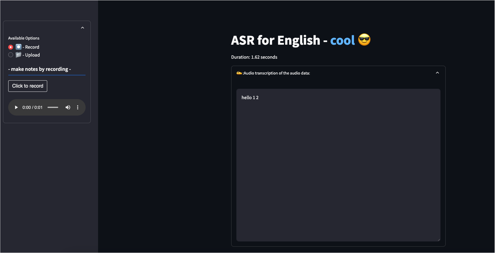
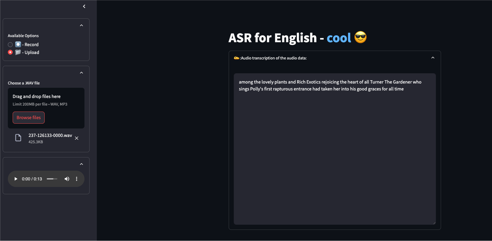

# ASR-WebUI : Deploying Data App to Azure  


### Pre-requisites:
Install below libraries from requirements.txt file
```sh
pip install -r requirements.txt 
```
## Design info:
-   used streamlit to create a data app
-   consuming microservice that is integrated with kaldi model

        
## Build and run?
    streamlit run app/app.py

## Result:



        
